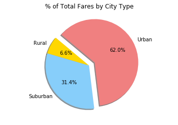

```python
# Dependencies

import matplotlib.pyplot as plt
import scipy.stats as stats
import os
import numpy as np
import pandas as pd
```


```python
# Import the required files

path = os.path.join('Resources', 'city_data.csv')
city_data = pd.read_csv(path)
city_data.head()

path2 = os.path.join('Resources', 'ride_data.csv')
ride_data = pd.read_csv(path2)
ride_data.head()

```


<div>
<style>
    .dataframe thead tr:only-child th {
        text-align: right;
    }

    .dataframe thead th {
        text-align: left;
    }

    .dataframe tbody tr th {
        vertical-align: top;
    }
</style>
<table border="1" class="dataframe">
  <thead>
    <tr style="text-align: right;">
      <th></th>
      <th>city</th>
      <th>date</th>
      <th>fare</th>
      <th>ride_id</th>
    </tr>
  </thead>
  <tbody>
    <tr>
      <th>0</th>
      <td>Sarabury</td>
      <td>2016-01-16 13:49:27</td>
      <td>38.35</td>
      <td>5403689035038</td>
    </tr>
    <tr>
      <th>1</th>
      <td>South Roy</td>
      <td>2016-01-02 18:42:34</td>
      <td>17.49</td>
      <td>4036272335942</td>
    </tr>
    <tr>
      <th>2</th>
      <td>Wiseborough</td>
      <td>2016-01-21 17:35:29</td>
      <td>44.18</td>
      <td>3645042422587</td>
    </tr>
    <tr>
      <th>3</th>
      <td>Spencertown</td>
      <td>2016-07-31 14:53:22</td>
      <td>6.87</td>
      <td>2242596575892</td>
    </tr>
    <tr>
      <th>4</th>
      <td>Nguyenbury</td>
      <td>2016-07-09 04:42:44</td>
      <td>6.28</td>
      <td>1543057793673</td>
    </tr>
  </tbody>
</table>
</div>


```python
city_data.head()
city_data.count()
```


    city            126
    driver_count    126
    type            126
    dtype: int64


```python
#By City Plots (Bubble Plots)
#Average Fare per City 

bycityavg = ride_data.groupby("city").mean()
bycityavg.head()
bycityavgrev = bycityavg.reset_index()
bycityavgrev = bycityavgrev.rename(columns={"fare":"Average Fare"})
bycityavgrev = bycityavgrev[["city", "Average Fare"]]
bycityavgrev.head()
```


<div>
<style>
    .dataframe thead tr:only-child th {
        text-align: right;
    }

    .dataframe thead th {
        text-align: left;
    }

    .dataframe tbody tr th {
        vertical-align: top;
    }
</style>
<table border="1" class="dataframe">
  <thead>
    <tr style="text-align: right;">
      <th></th>
      <th>city</th>
      <th>Average Fare</th>
    </tr>
  </thead>
  <tbody>
    <tr>
      <th>0</th>
      <td>Alvarezhaven</td>
      <td>23.928710</td>
    </tr>
    <tr>
      <th>1</th>
      <td>Alyssaberg</td>
      <td>20.609615</td>
    </tr>
    <tr>
      <th>2</th>
      <td>Anitamouth</td>
      <td>37.315556</td>
    </tr>
    <tr>
      <th>3</th>
      <td>Antoniomouth</td>
      <td>23.625000</td>
    </tr>
    <tr>
      <th>4</th>
      <td>Aprilchester</td>
      <td>21.981579</td>
    </tr>
  </tbody>
</table>
</div>


```python
#Total Counts of Ride per City

bycitytotal = ride_data.groupby("city").count()
bycitytotal = bycitytotal[["date"]]
bycitytotal = bycitytotal.rename(columns={"date":"Total Rides"})
bycitytotalrev = bycitytotal.reset_index()

bycitytotalrev.head()
```


<div>
<style>
    .dataframe thead tr:only-child th {
        text-align: right;
    }

    .dataframe thead th {
        text-align: left;
    }

    .dataframe tbody tr th {
        vertical-align: top;
    }
</style>
<table border="1" class="dataframe">
  <thead>
    <tr style="text-align: right;">
      <th></th>
      <th>city</th>
      <th>Total Rides</th>
    </tr>
  </thead>
  <tbody>
    <tr>
      <th>0</th>
      <td>Alvarezhaven</td>
      <td>31</td>
    </tr>
    <tr>
      <th>1</th>
      <td>Alyssaberg</td>
      <td>26</td>
    </tr>
    <tr>
      <th>2</th>
      <td>Anitamouth</td>
      <td>9</td>
    </tr>
    <tr>
      <th>3</th>
      <td>Antoniomouth</td>
      <td>22</td>
    </tr>
    <tr>
      <th>4</th>
      <td>Aprilchester</td>
      <td>19</td>
    </tr>
  </tbody>
</table>
</div>


```python
#Merge the required data frames

mergedata_df = city_data.merge(bycityavgrev, how="outer", on="city")
mergedatafinal_df = mergedata_df.merge(bycitytotalrev, how="outer", on="city")
mergedatafinal_df.head()
```


<div>
<style>
    .dataframe thead tr:only-child th {
        text-align: right;
    }

    .dataframe thead th {
        text-align: left;
    }

    .dataframe tbody tr th {
        vertical-align: top;
    }
</style>
<table border="1" class="dataframe">
  <thead>
    <tr style="text-align: right;">
      <th></th>
      <th>city</th>
      <th>driver_count</th>
      <th>type</th>
      <th>Average Fare</th>
      <th>Total Rides</th>
    </tr>
  </thead>
  <tbody>
    <tr>
      <th>0</th>
      <td>Kelseyland</td>
      <td>63</td>
      <td>Urban</td>
      <td>21.806429</td>
      <td>28</td>
    </tr>
    <tr>
      <th>1</th>
      <td>Nguyenbury</td>
      <td>8</td>
      <td>Urban</td>
      <td>25.899615</td>
      <td>26</td>
    </tr>
    <tr>
      <th>2</th>
      <td>East Douglas</td>
      <td>12</td>
      <td>Urban</td>
      <td>26.169091</td>
      <td>22</td>
    </tr>
    <tr>
      <th>3</th>
      <td>West Dawnfurt</td>
      <td>34</td>
      <td>Urban</td>
      <td>22.330345</td>
      <td>29</td>
    </tr>
    <tr>
      <th>4</th>
      <td>Rodriguezburgh</td>
      <td>52</td>
      <td>Urban</td>
      <td>21.332609</td>
      <td>23</td>
    </tr>
  </tbody>
</table>
</div>


```python
avgfare = mergedatafinal_df["Average Fare"]
totalrides = mergedatafinal_df["Total Rides"]
drivercount = mergedatafinal_df["driver_count"]
city_type = mergedatafinal_df["type"]

#Identify Urban cities and assign color Light Coral

urbancity = mergedatafinal_df.loc[mergedatafinal_df["type"]=="Urban"]
urbancity["Color"]="lightcoral"
urbancity = urbancity[["city", "Color"]]

#Identify Urban cities and assign color Light Sky Blue

suburbancity = mergedatafinal_df.loc[mergedatafinal_df["type"]=="Suburban"]
suburbancity["Color"]="lightskyblue"
suburbancity = suburbancity[["city", "Color"]]

#Identify Urban cities and assign color Gold

ruralcity = mergedatafinal_df.loc[mergedatafinal_df["type"]=="Rural"]
ruralcity["Color"]="gold"
ruralcity = ruralcity[["city", "Color"]]

#Concatinate the data files

temp1_df = pd.concat([urbancity, suburbancity, ruralcity])
temp1_df

mergedatafinalcolor = mergedatafinal_df
cityfinal_df = mergedatafinalcolor.merge(temp1_df, how="outer", on="city")
cityfinal_df.head()

colors = cityfinal_df["Color"]
city_type2 = cityfinal_df["type"]

#Plot scatter plot data

plt.scatter(totalrides, avgfare, marker="o", sizes=drivercount, 
            facecolor=colors, edgecolors="black", 
            alpha=0.75)
plt.title("PyBer Ride Sharing Data")
plt.ylabel("Total Rides per City")
plt.xlabel("Average Fare per City")
#plt.legend(handles=[city_type],
#         loc="best")
plt.grid()

#Save the file image
plt.savefig("PyberScatter.png")

#Show the plot
plt.show()

```

    /anaconda3/envs/PythonData/lib/python3.6/site-packages/ipykernel/__main__.py:9: SettingWithCopyWarning: 
    A value is trying to be set on a copy of a slice from a DataFrame.
    Try using .loc[row_indexer,col_indexer] = value instead
    
    See the caveats in the documentation: http://pandas.pydata.org/pandas-docs/stable/indexing.html#indexing-view-versus-copy
    /anaconda3/envs/PythonData/lib/python3.6/site-packages/ipykernel/__main__.py:15: SettingWithCopyWarning: 
    A value is trying to be set on a copy of a slice from a DataFrame.
    Try using .loc[row_indexer,col_indexer] = value instead
    
    See the caveats in the documentation: http://pandas.pydata.org/pandas-docs/stable/indexing.html#indexing-view-versus-copy
    /anaconda3/envs/PythonData/lib/python3.6/site-packages/ipykernel/__main__.py:21: SettingWithCopyWarning: 
    A value is trying to be set on a copy of a slice from a DataFrame.
    Try using .loc[row_indexer,col_indexer] = value instead
    
    See the caveats in the documentation: http://pandas.pydata.org/pandas-docs/stable/indexing.html#indexing-view-versus-copy


```python
#Pie Charts by City type

#Total Fares by City

ride_data.head()

faretotalcity_df = ride_data.groupby("city").sum()
faretotalcityrev_df = faretotalcity_df.reset_index()
faretotalcityrev_df = faretotalcityrev_df[["city","fare"]]
faretotalcityrev_df = faretotalcityrev_df.rename(columns={"fare":"Total Fares"})
faretotalcityrev_df.head()
```


<div>
<style>
    .dataframe thead tr:only-child th {
        text-align: right;
    }

    .dataframe thead th {
        text-align: left;
    }

    .dataframe tbody tr th {
        vertical-align: top;
    }
</style>
<table border="1" class="dataframe">
  <thead>
    <tr style="text-align: right;">
      <th></th>
      <th>city</th>
      <th>Total Fares</th>
    </tr>
  </thead>
  <tbody>
    <tr>
      <th>0</th>
      <td>Alvarezhaven</td>
      <td>741.79</td>
    </tr>
    <tr>
      <th>1</th>
      <td>Alyssaberg</td>
      <td>535.85</td>
    </tr>
    <tr>
      <th>2</th>
      <td>Anitamouth</td>
      <td>335.84</td>
    </tr>
    <tr>
      <th>3</th>
      <td>Antoniomouth</td>
      <td>519.75</td>
    </tr>
    <tr>
      <th>4</th>
      <td>Aprilchester</td>
      <td>417.65</td>
    </tr>
  </tbody>
</table>
</div>


```python
#Merge data with city_data

mergedatafinal2_df = mergedata_df.merge(faretotalcityrev_df, how="outer", on="city")
totalfares = mergedatafinal2_df["Total Fares"]
mergedatafinal2_df.head()

bycitytotalfares = mergedatafinal2_df.groupby("type").sum()
bycitytotalfaresrev = bycitytotalfares.reset_index()
bycitytotalfaresrev = bycitytotalfaresrev[["type", "Total Fares"]]
bycitytotalfaresrev

city_type = bycitytotalfaresrev["type"]
total_fares_type = bycitytotalfaresrev["Total Fares"]

#plot the pie charts
#plot the % of Total Fares by City Type

colors = ["gold", "lightskyblue", "lightcoral"]
explode = [0, 0, 0.15]
plt.axis("equal")

plt.pie(total_fares_type, labels=city_type, colors=colors, explode=explode,
        autopct="{0:1.1f}%".format, shadow=True, startangle=140)
plt.title("% of Total Fares by City Type")
plt.savefig("TotalFaresPie.png")
plt.show()
```





```python
#plot the % of Total Rides by City Type

mergedatafinal_df.head()

bycitytotalrides = mergedatafinal_df.groupby("type").sum()
bycitytotalridesrev = bycitytotalrides.reset_index()
bycitytotalridesrev = bycitytotalridesrev[["type", "Total Rides"]]
bycitytotalridesrev

city_type_rides = bycitytotalridesrev["type"]
totalrides = bycitytotalridesrev["Total Rides"]

#plot the pie chart
#plot the % of Total Rides by City Type

colors = ["gold", "lightskyblue", "lightcoral"]
explode = [0, 0, 0.15]
plt.axis("equal")

plt.pie(totalrides, labels=city_type_rides, colors=colors, explode=explode,
        autopct="{0:1.1f}%".format, shadow=True, startangle=140)
plt.title("% of Total Rides by City Type")
plt.savefig("TotalRidesPie.png")
plt.show()
```


```python
#plot the % of Total Rides by Total Drivers

mergedatafinal_df.head()

bycitytotaldriver = mergedatafinal_df.groupby("type").sum()
bycitytotaldriverrev = bycitytotaldriver.reset_index()
bycitytotaldriverrev = bycitytotaldriverrev[["type", "driver_count"]]
bycitytotaldriverrev

city_type_driver = bycitytotaldriverrev["type"]
totaldriver = bycitytotaldriverrev["driver_count"]

#plot the pie chart
#plot the % of Total Rides by City Type

colors = ["gold", "lightskyblue", "lightcoral"]
explode = [0, 0, 0.15]
plt.axis("equal")

plt.pie(totaldriver, labels=city_type_driver, colors=colors, explode=explode,
        autopct="{0:1.1f}%".format, shadow=True, startangle=140)
plt.title("% of Total Drivers by City Type")
plt.savefig("TotalDriversPie.png")
plt.show()
```


# HW5-MatPlotLib
#HW5-MatPlotLib
